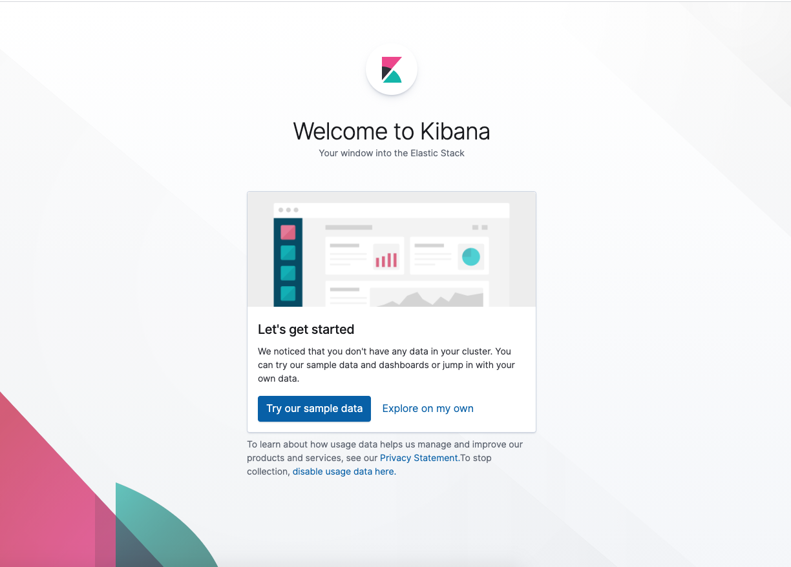

## Automated ELK Stack Deployment

The files in this repository were used to configure the network depicted below.

These files have been tested and used to generate a live ELK deployment on Azure. They can be used to either recreate the entire deployment pictured above. Alternatively, select portions of the yml file may be used to install only certain pieces of it, such as Filebeat.

  - _TODO: Enter the playbook file._

This document contains the following details:
- Description of the Topology
- Access Policies
- ELK Configuration
  - Beats in Use
  - Machines Being Monitored
- How to Use the Ansible Build

### Description of the Topology

The main purpose of this network is to expose a load-balanced and monitored instance of DVWA, the D*mn Vulnerable Web Application.

Load balancing ensures that the application will be highly available, in addition to restricting access to the network.
- Load balancers protect Availabiity, Web Traffic & Security. It protects against distributed denial-of-service (DDoS) attacks as it diverts traffic and distributes the load. 
- The advantages of a Jumpbox are Automation, Access Control, Security & Network Segmentation. It provides controlled access to the system/virtual machines/servers containing the applications and eases the management of these machines.

Integrating an ELK server allows users to easily monitor the vulnerable VMs for changes to the log files and system metrics.
- Filebeat watches for the changes in log files or locations that you specify. 
- Metricbeat records the metrics & statistics from the operating system and sends it to Elasticsearch or Logstash

The configuration details of each machine may be found below.

| Name    | Function                       |          IP Address          | Operating System |
|---------|--------------------------------|:----------------------------:|:----------------:|
| Jumpbox | Gateway                        |   23.96.99.94   10.1.1.7  |       LINUX      |
| Web-1   | Webserver/Holds DVWA container |           10.1.1.5           |       LINUX      |
| Web-2   | Webserver/Holds DVWA container |           10.1.1.6           |       LINUX      |
| Web-3   | Webserver/Holds DVWA container |           10.1.1.8           |       LINUX      |
| ELK     | Holds Elk container            | 51.141.187.168   10.0.0.4 |       LINUX      |

### Access Policies

The machines on the internal network are not exposed to the public Internet. 

Only the Jumpbox machine can accept connections from the Internet. Access to this machine is only allowed from the following IP addresses:
- 184.144.0.0/13 (Home IP Address)

Machines within the network can only be accessed by SSH. 
The only machine that is able to connect to the ELK server is the Jumpbox (10.1.1.7)

A summary of the access policies in place can be found in the table below.

| Name    | Publicly Accessible | Allowed IP Addresses |
|---------|:-------------------:|:--------------------:|
| Jumpbox |         Yes         |    184.144.0.0/13    |
| Web-1   |          No         |       10.1.1.7       |
| Web-2   |          No         |       10.1.1.7       |
| Web-3   |          No         |       10.1.1.7       |
| ELK     |         Yes         |    184.144.0.0/13    |

### Elk Configuration

Ansible was used to automate configuration of the ELK machine. No configuration was performed manually, which is advantageous because IT administrators can configure multiple machines at once consistently by running the ansible playbook which will be more efficient and less time consuming. 

The playbook implements the following tasks:

- Install docker.io
- Install PIP
- Install docker python module
- Download & launch the docker elk container
- Run the appropriate command to increase the system memory

The following screenshot displays the result of running `docker ps` after successfully configuring the ELK instance.

### Target Machines & Beats
This ELK server is configured to monitor the following machines:
- Web-1: 10.1.1.5
- Web-2: 10.1.1.6
- Web-3: 10.1.1.8

We have installed the following Beats on these machines:
- Filebeat
- Metricbeat

These Beats allow us to collect the following information from each machine:
- Filebeat monitors the Web VM's log files in the locations that we specify to see if there are any changes or if any modifications have been made. Ex: Log events
- Metricbeat records the metrics and statistics from the operating system and from the services running on the server. Ex: Apache service

### Using the Playbook
In order to use the playbook, you will need to have an Ansible control node already configured. Assuming you have such a control node provisioned: 

SSH into the control node and follow the steps below:

- Copy the install-elk.yml to the /etc/ansible/ directory inside the ansible container.
  - $ sudo docker cp install-elk.yml
    <NameOfContainer>:/etc/ansible/install-elk.yml

- Update the /etc/ansible/hosts file to include the ELK VM's IP Address

- Run the playbook, and navigate to http://[Insert-Your-VM-IP]:5601/app/kibana. to check that the installation worked as expected.

  - $ ansible-playbook /etc/ansible/install-elk.yml
- Check that the Elk playbook is working by accessing Kibana from a web browser and you should see the below image.

_As a **Bonus**, provide the specific commands the user will need to run to download the playbook, update the files, etc._
